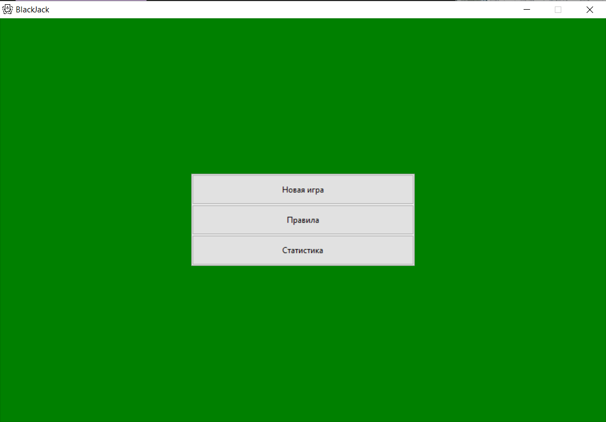
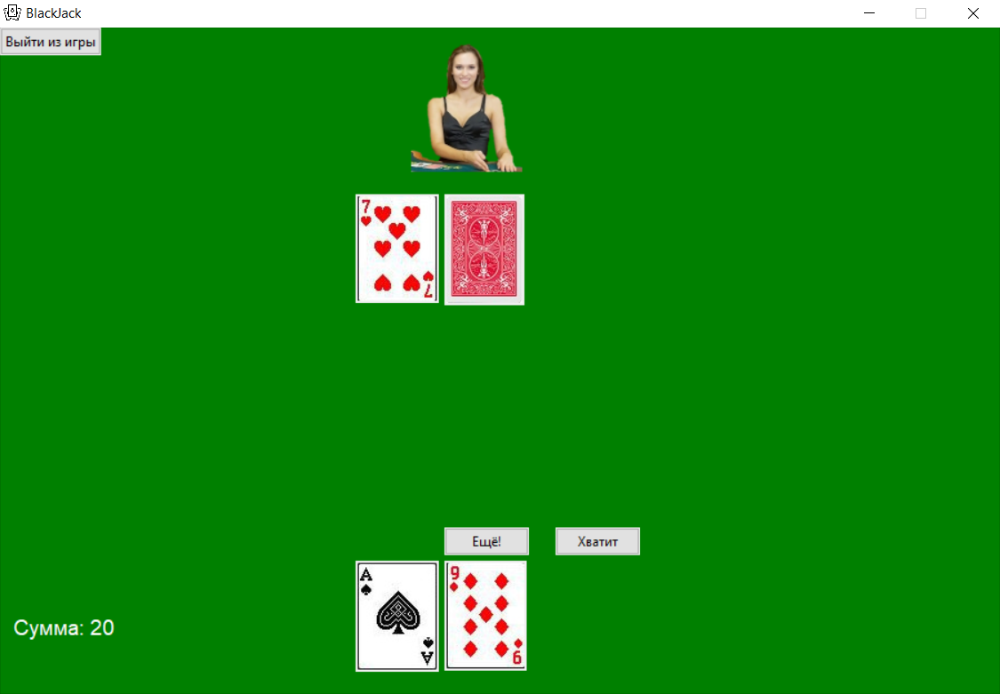
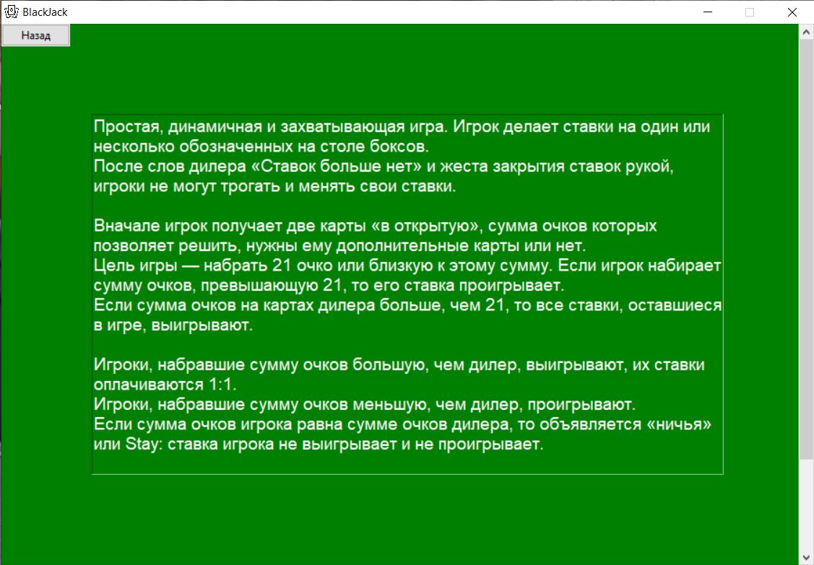
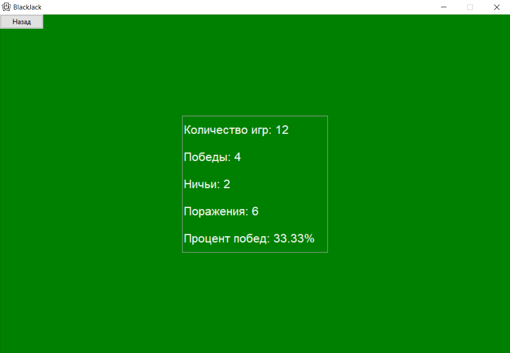

# Простой BlackJack на Python

## Оглавление

1. [Внимание!](#внимание)
2. [Меню](#меню)
3. [Процесс игры](#процесс-игры)
4. [Правила игры](#правила-игры)
5. [Статистика](#статистика)

## Внимание!

В папке `project` лежит файл `BlackJack.py` - исходный код проекта. Для запуска игры необходимо иметь версию Python 3.11 и выше. 
Для компиляции файла `.py` в `.exe` можно воспользоваться утилитой `auto-py-to-exe`

## Меню

Меню

## Процесс игры

Процесс игры

## Правила игры

Правила игры

## Статистика

Статистика

